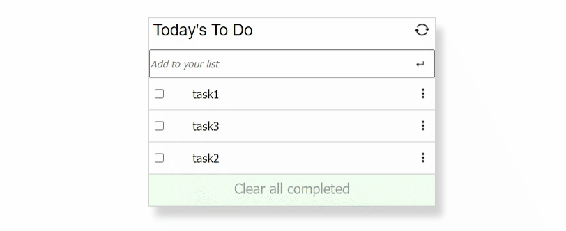

# To-Do-List Project.

> This project is built with HTML, CSS and JavaScript.

> A simple TO-DO-LIST where you can Add, Remove tasks , and also you can mark tasks as completed and clear all completed tasks.

# Demo 

## Built With
### Major languages
- HTML
- CSS
- Javascript

### Technologies used
- Github
- Git
- Visual Studio Code

## Getting Started
To get a local copy up and running follow these simple example steps:
* git clone  https://github.com/Danieldotcomcoder/TO-DO-LIST.git
* open terminal and type : 1-  npm run build.
                           2-  npm start. 

To see a live version:
* https://danieldotcomcoder.github.io/TO-DO-LIST/
## Author
👤 Daniel Shdeed

- GitHub: [https://github.com/Danieldotcomcoder)]
- Twitter: [https://twitter.com/DannyDotcoder)]
- LinkedIn: [https://www.linkedin.com/in/daniel-shdeed-832b03115/]

## 🤝 Contributing
Contributions, issues, and feature requests are welcome!

Feel free to check the issues page.

## Show your support
Give a ⭐️ if you like this project!

📝 License
This project is MIT licensed.
